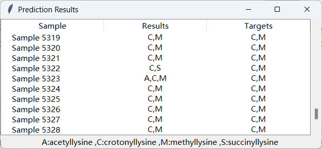

# Protein-multi-classification  
**This study integrates the Cluster-Centroids under-sampling algorithm with a Convolutional Neural Network (CNN) to construct a multi-label prediction model for predicting multiple lysine modification sites in post-translational protein modification.**

### 1.File Structure and Functional Description
* **Data**  
    `Train dataset`：Original Training Data  
    `Test dataset`：Original Testing Data  
    `PSTAAP_train.m`：Script for Feature Extraction from the Training Set->`PSTAAP_train.mat `
    `PSTAAP_test.m`：Script for Feature Extraction from the Testing Set->`PSTAAP_test.mat`
* **DataProcess.py**: Implement Multi-label Construction of Sample Data and Under-sampling of Training Data  
* **PSTAAP.py**: Implement model construction, carry out model training, and perform 5-fold cross-validation and performance testing
* **predictor.py**：Implement a user-friendly interface for predictive demonstration by selecting models and datasets
### 2.User Guide
#### 2.1 Using the Experimental Data for Prediction
* Run the `predictor.py` script, select the prediction data from `Data/PSTAAP_test.mat`, choose the pth file from the `model/` directory, and simply perform the prediction
#### 2.2 Predict with Custom Data
* First, convert your data to the format used in the `Data/Test dataset` directory. Then, using MATLAB, alter the file path in the `Data/PSTAAP_test.m` script to point to your own file path and execute it to get the .mat file with extracted features
* Run the `predictor.py` script, and follow the same steps as described in section 2.1, but select your own data
### 3.Presentation of Predictive Results

* As shown in the figure, "Results" represents the predicted labels for the samples, and "Targets" represents the actual true labels that the samples possess.